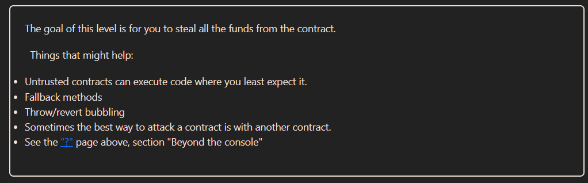

# Solution explanation:

## This contract is vulnerable to a "Reentrancy attack". This is caused because in the ``withdraw()`` function, the user balance is modified after an external call is made, that creates the possibility to implement a ``receive()`` function in the receiver contract. This function will recursively call the ``withdraw()`` function before the balance is updated, re-entering the function until the victim is drained.