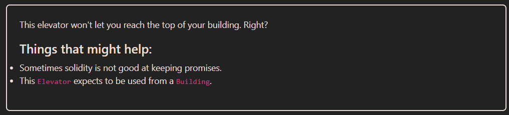

# Solution explanation:

## ``goTo()`` function in ``Elevator`` contract, expects a logic implementation from a ``Building`` contract to determine whether a floor is a top or not. This implementation can be specifically made to trick ``goTo()``'s logic, inversing the bool value in ``Building`` contract: ``bool top`` in order to provide two different values in the same transaction.