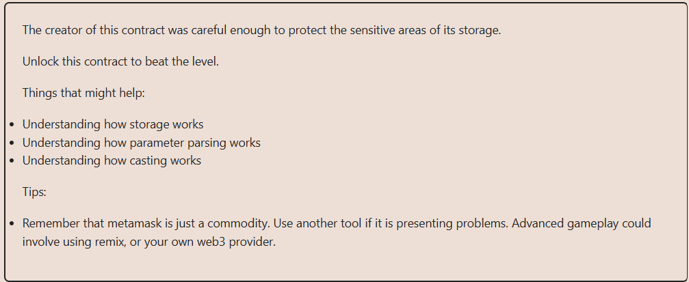
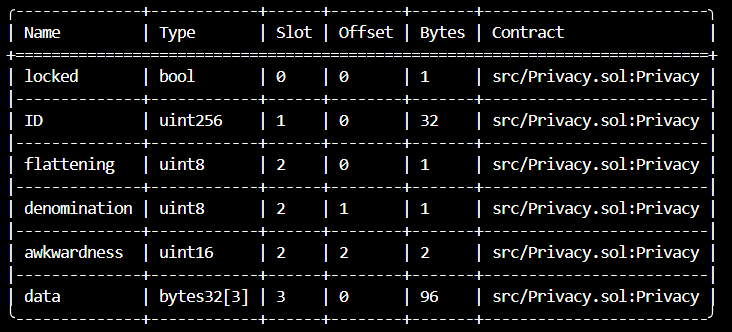

# Solution explanation: 

## In the EVM, every ``storage`` slot takes up to 32 bytes and is stored in the same order they are declared, this implies that multiple variables may be stored in the same slot if the size of these <= 32 bytes (256 bits). Given the next variables: ``uint256 a`` ``uint128 b`` ``uint64 c`` ``uint64 d``, "a" will take storage slot[0], "b,c" and "d" will take storage slot[1]. In the case of static arrays like ``bytes32[3] data``, each element will take one storage slot subsequently since every element has sizes 256 bits. To access ``bytes16(data[2])``, (required for ``unlock()``) which is the third element of the array, we must access storage slot number 5.
## In ``Privacy.sol`` the variables layout is the next: 

## Since we need the third element of the array and the array takes 3 storage slots we must access slot[5]