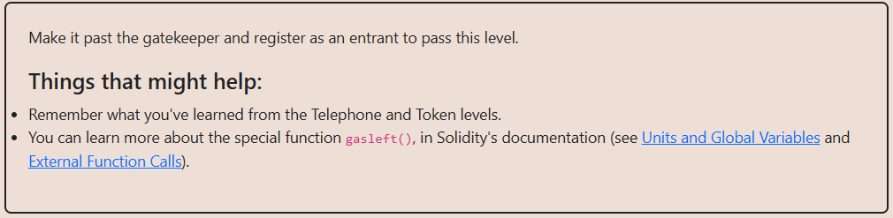

# Solution explanation:

## In Solidity, explicit type conversion (casting) between integers of different sizes results in specific truncation behaviors. When downcasting from a larger type (e.g., uint64) to a smaller type (e.g., uint32), the higher-order bits (leftmost) are discarded, and only the lower-order bits (rightmost) are preserved. Furthermore, logical comparisons between these casted values require precise bit manipulation. To satisfy a condition where uint32(key) == uint16(key), the bits present in the 32 bit view but absent in the 16 bit view (bytes 5 and 6 of the total 8 bytes) must be zero. Conversely, for uint64(key) != uint32(key), the upper 32 bits must not be zero.
## In GatekeeperOne.sol, the logic required to construct the _gateKey relies on the following bitwise structure relative to tx.origin: Since we need to preserve the lower 16 bits of tx.origin, zero out the bits at positions 16-32 to satisfy the casting equality, and ensure the upper 32 bits are non-zero to satisfy the inequality, we must apply the bitwise mask 0xFFFFFFFF0000FFFF to the address.
