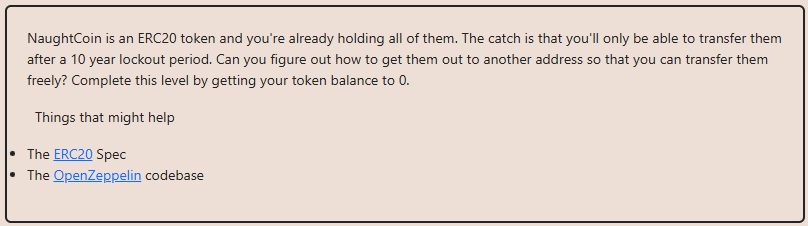

# Solution explanation:

## ERC20 standard implements a function named `transferFrom()` that allows transfering tokens from a specific address to another one. Calling this function from the token holder address permits bypassing the time-lock that is implemented in the `transfer()` function.