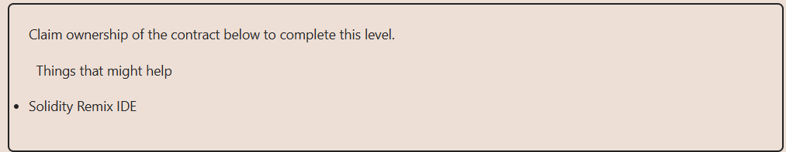

# Solution:

## Constructor is not properly initialized with ``constructor()`` keyword, instead, contract uses a public function named ``Fal1out()``, which allows any user to call it and claim ownership of the contract