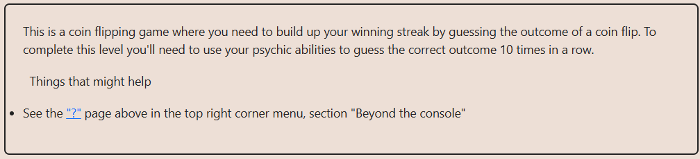

# Solution explanation:

## ``flip()`` function uses "pseudo-randomness" to determine side, this "pseudo-randomness" can be exploited since the operation to determine side is public, an attackant can simulate result and then call ``flip()`` function with the correct guess within the same ``block.number`` 