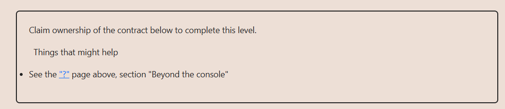

# Solution:

## ``changeOwner()`` function implements the next conditional ``if (tx.origin != msg.sender) { owner = _owner; }``, ``tx.origin`` is manipulable through a router contract, setting the opportunity to an attacker to make ``msg.sender`` not match ``tx.origin`` and claim ``owner`` status