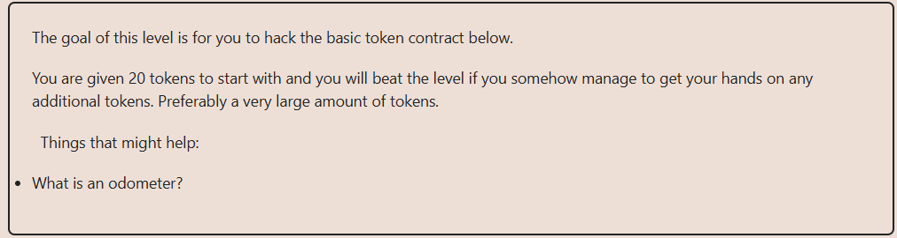

# Solution explanation:

## This contract originally runs on ``pragma solidity ^0.6.0``, in that version, uint are ``unchecked`` by default, what means that the values are vulnerable to mathematical under/overflows. For this exercise, I upgraded the Solidity version and used ``unchecked`` keyword where needed to reproduce the vulnerability.
## Example:
## ``uint16 value = 0`` -> ``value = value - 1`` -> ``value == 65534``