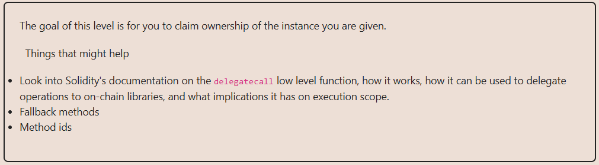

# Solution:

## ``Delegate`` contract implements a ``fallback()`` function that makes a ``delegateCall()`` with the data as a parameter that is received upon ``fallback()`` function. The attacker can make a transaction via ``call()`` being the target the ``Delegate`` contract, passing as data the ``pwn()`` function selector encoded. The ``delegateCall`` function will delegate the execution logic to ``Delegation`` contract, but ``Delegate`` storage will be modified.