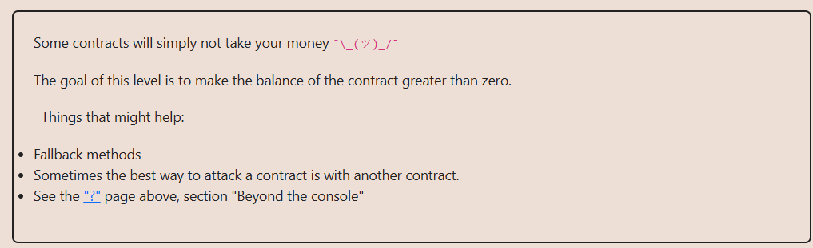

# Solution explanation:

## Altough ``Force`` contract does not implement any ``receive()`` or ``fallback()`` function to receive ETH, there is a way to transfer balance: through ``selfdestruct`` keyword. ``selfdestruct`` can be implemented in the function of another contract, passing an address through the parameter, and the contract will force-send ETH to that address.