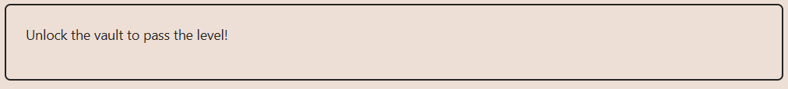
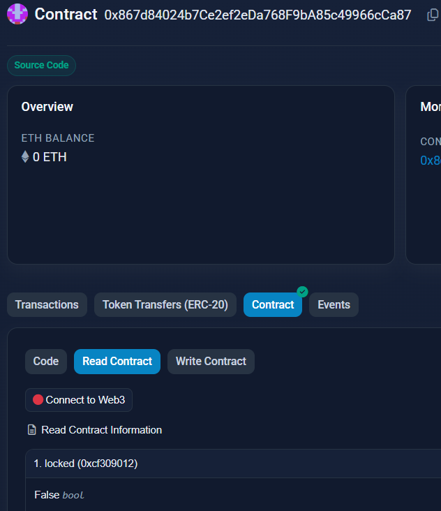

# Solution explanation:

## A ``private`` keyword blocks external contracts to access to that variable or function. In the case of variables, its value is still readable because the _storage_ of a contract is accessible to anyone.
## In this example, I used a Foundry deployment script to deploy Vault contract to Sepolia Testnet with a custom password as parameter (0x1234000000000000000000000000000000000000000000000000000000000000), then I used ``cast storage 0x867d84024b7ce2ef2eda768f9ba85c49966cca87 1 --rpc-url $ALCHEMY_SEPOLIA_RPC_URL`` to retreive the value. With the provided value, now it's possible to unlock the ``Vault`` contract via: ``cast send 0x867d84024b7ce2ef2eda768f9ba85c49966cca87 "unlock(bytes32)" 0x1234000000000000000000000000000000000000000000000000000000000000 --rpc-url $ALCHEMY_SEPOLIA_RPC_URL --private-key $DEPLOY_PRIVATE_KEY``

