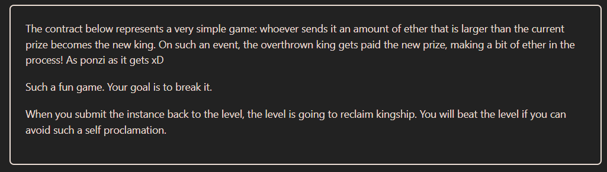

# Solution explanation:

## In EVM, there are two different types of accounts: Externallly Owned Accounts (EOA) and Contract Accounts, both can receive ether, but for Contract Accounts, it is necessary to implement ``receive()`` or ``fallback()`` functions. If those functions are not implemented, any attempt of receiving ETH will revert. (Except with ``selfdestruct`` cases). 